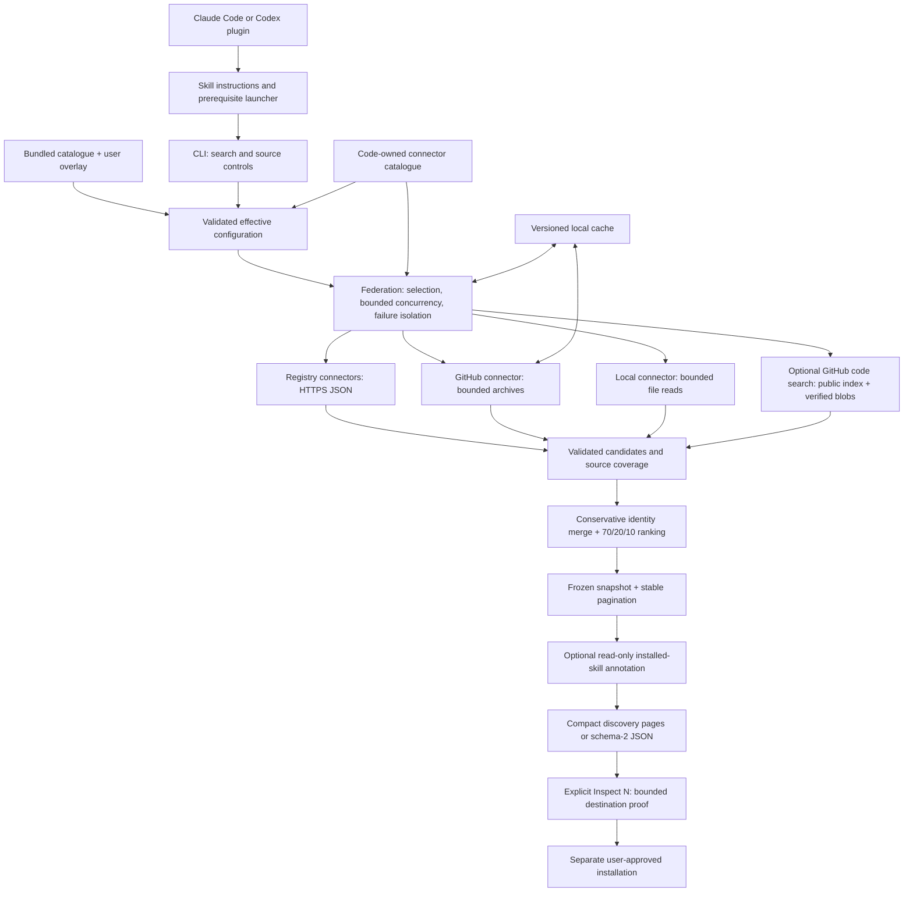

# Architecture

Universal Skill Finder is a local discovery engine packaged once and exposed through Claude Code and Codex plugins. It queries enabled sources concurrently, ranks and freezes a bounded pool, and returns a deterministic page of 25 discovery results by default. It checks a destination only when the user inspects a result. It does not host an index, execute discovered code, or install results during search.

**Source** is the umbrella term for a searchable location. Source types are **Registry** (a hosted skill index), **Repository** (Git files containing skills), **Local directory** (files on disk), and **Search index** (GitHub code search). A **catalogue** is a combined list or index, such as the bundled source catalogue. A **connector** is the code that searches a source. The existing `source_*` fields and source-pack formats use the same terminology.

The repository is `bibryam/universal-skill-finder`. Both clients install the `skill` plugin from the `skill` marketplace; its `find` skill lives at `skills/find`. The canonical Python package is `universal_skill_finder`, its orchestrator is `UniversalSkillFinder`, and the internal CLI is `skill-find`. Client invocation is `/skill:find` in Claude Code and `$skill:find` in Codex.

This document covers the source tree, extension contract, revision model, and release model. The independently portable skill carries its own [runtime reference](skills/find/references/architecture.md), [configuration guide](skills/find/references/configuration.md), and [JSON contract](skills/find/references/result-schema.md).

## High-level design



Python 3.10+ and working SSL are the only search-runtime prerequisites. POSIX and PowerShell launchers check them before importing the engine. Failure stops with exit 4 before configuration/cache access or network requests. Plugin managers may copy files before this check; installation success is not proof of runtime readiness.

### Code ownership

| Boundary | Implementation | Responsibility |
|---|---|---|
| Host packaging | `.codex-plugin`, `.claude-plugin`, `.agents/plugins` | Thin plugin and marketplace manifests, not duplicate engines |
| Agent workflow | [SKILL.md](skills/find/SKILL.md) | Plain requests, compact discovery output, saved follow-ups and separate inspection/installation approval |
| Configuration | [config.py](skills/find/scripts/universal_skill_finder/config.py) | Defaults, one source-choice file, packs, validation, persistent controls |
| Connector contract | [adapters/base.py](skills/find/scripts/universal_skill_finder/adapters/base.py), [adapters/__init__.py](skills/find/scripts/universal_skill_finder/adapters/__init__.py) | Protocol and one immutable connector catalogue |
| Orchestration | [federation.py](skills/find/scripts/universal_skill_finder/federation.py) | Fair admission, supervised source work, normalization, deduplication, ranking and pool freeze |
| GitHub discovery | [github_search.py](skills/find/scripts/universal_skill_finder/adapters/github_search.py) | Fixed-origin, explicit-token public code search and bounded file validation |
| Tessl discovery | [tessl.py](skills/find/scripts/universal_skill_finder/adapters/tessl.py) | Anonymous bounded hybrid search; individual skills and inspection-only skill packages |
| Local inventory | [installed.py](skills/find/scripts/universal_skill_finder/installed.py) | Read-only, host-specific installed-instruction evidence after ranking |
| Input boundaries | [http.py](skills/find/scripts/universal_skill_finder/http.py), [validation.py](skills/find/scripts/universal_skill_finder/validation.py), repository adapters, [models.py](skills/find/scripts/universal_skill_finder/models.py) | Guarded discovery and separate anonymous destination proof |
| Output | [presentation.py](skills/find/scripts/universal_skill_finder/presentation.py), [source_presentation.py](skills/find/scripts/universal_skill_finder/source_presentation.py) | Structurally reviewed discovery links, compact pages, detailed inspection and safe configuration views |
| Provenance | [versioning.py](skills/find/scripts/universal_skill_finder/versioning.py), [cache.py](skills/find/scripts/universal_skill_finder/cache.py) | Central versions, content revisions, compatible cache envelopes |
| Release | [check_release.py](scripts/check_release.py), [build_release.py](scripts/build_release.py) | Portable-payload checks and allowlisted, checksummed release artifacts |

## Connector, source, and pack are different things

| Unit | Example | How to extend it |
|---|---|---|
| Connector / adapter | `github-repo`, `skills-sh`, `http-json-v1` | Reviewed Python code when the protocol differs |
| Source | `openai-skills`, a team repository, a compatible JSON endpoint | Configuration referencing an existing connector |
| Source pack | `official-repositories`, a reviewed team collection | Local declarative JSON grouping source instances |

Many sources can share one connector. There is no need to write an adapter for another GitHub repository or compatible GET/JSON API. Conversely, an API with a different authentication, pagination, or response contract should not be forced through generic mappings.

`ADAPTER_SPECS` is the single code-owned registration point. Each frozen `AdapterSpec` declares its factory, source kind, required fields, cache policy, relevance basis, and adapter-contract version. Validation, factory construction, source-pack kind inference, federation cache routing, and result admission use that catalogue. Duplicate IDs, unknown connectors, incompatible contract versions, and kind mismatches fail early. Source packs cannot import Python modules or supply executables.

## The connector contract

```python
class Adapter(Protocol):
    name: str

    def search(
        self, source: dict[str, Any], query: str,
        limit: int, context: AdapterContext,
    ) -> list[Candidate]: ...
```

The context supplies the guarded HTTP client, cache, settings, offline/refresh flags, and cache-age reporting. Connector instances are shared across concurrent source calls: keep them stateless and keep per-call state in local variables or the context.

A connector must:

1. Return at most the requested limit in native relevance order. A valid empty response is success with zero candidates.
2. Normalize metadata into `Candidate` records with native identity/rank, name, description, location, and optional source metrics.
3. Raise `SourceUnavailable(status, detail)` for recognized failures such as `auth_missing`, `rate_limited`, or `schema_mismatch`. Do not turn malformed responses into false successful empties.
4. Use the guarded transport and bounded readers. Never execute discovered instructions, scripts, hooks, or installation hints; never mutate configuration.
5. Respect offline mode. Query-cached registries are served by federation; catalogue-cached connectors must handle catalogue/offline behavior themselves; uncached local discovery reads only local files.
6. Set `context.incomplete_results = True` with a bounded `detail` if upstream incompleteness or skipped checks prevent a complete response. Keep valid candidates, including an empty partial set. Federation preserves the flag in fresh/cached coverage; strict mode fails and the table shows a partial status.

Federation validates fresh and cached candidates and rebinds source ID, kind, adapter, and provenance to the configured source. A registry cannot impersonate another source through response fields. Unexpected failures are isolated to that source and remain visible in coverage.

### Cache policy is explicit

| Policy | Current connectors | Owner and behavior |
|---|---|---|
| `query` | Named registries, `github-code-search` and `http-json-v1` | Federation caches exact source/query/per-source-limit responses, including partial coverage |
| `catalogue` | `github-repo` | Connector caches the bounded repository catalogue; new queries filter it locally |
| `none` | `local-directory` | Connector reads current local metadata; no network request |

Cache format and adapter-contract versions are included in keys and envelopes. Incompatible or legacy entries are treated as misses, never trusted or fetched online as an offline fallback. Old cache files are not automatically deleted. Compatible cached data can still outlive changes in an upstream API; use refresh when freshness matters.

## Search and output contracts

The request pipeline is: validate configuration, resolve direct/pack enablement, apply explicit selection/exclusion, search concurrently, normalize, conservatively deduplicate, rank the complete pool, freeze it, and present a slice.

- Search defaults to every enabled source. A disabled pack blocks its directly enabled sources.
- Dry runs show planned destinations without contacting them. GitHub repository discovery uses `codeload.github.com`; optional stars are read only from a separate fresh cache and never trigger a metadata request.
- Every configured source gets a coverage record, including failures, disabled/excluded sources, offline misses, cached answers, and successful zero-match responses.
- Names alone never identify a skill. Repository/path and hosted identity take precedence over a canonical URL. URL query parameters, fragments, and semicolon parameters are retained because they can distinguish skills.
- `discovery-70-20-10-v1` assigns 70% to query relevance, 20% to a normalized source-local signal, and 10% to independent connector-family corroboration. It records deterministic component evidence and tie-breaks. Raw metrics never cross source boundaries; destination state and installation readiness do not affect rank.
- Provider-query connectors retain their bounded native results even if sparse metadata has no local lexical overlap. Repository and local catalogue connectors still require a positive query match.
- The ranked pool freezes at collection cutoff. Default output requests up to 20 candidates per source, retains up to 100 overall, and materializes 25 compact results per page.
- Explicit snapshots preserve complete result records, coverage, ranking evidence, and stable numbering. `Next page` and `Show all` perform no network access or reranking. `Search deeper` creates a new pool and may change numbers.
- Search rows show linked name plus path, then sources, one source-native metric, and a short description. A link is a code-owned registry route or normalized GitHub identity, not a destination or installation proof. `Inspect #N` performs the fresh exact checks needed for a proposal. Search never runs a displayed command.

The JSON search report is schema 2 and contains provenance, query/mode/page context, validation partitions, results, coverage, timing and explicit snapshot state. Additive occurrence/source fields retain their established names. See the [complete field definitions](skills/find/references/result-schema.md). Full reports may contain local paths and private queries; sanitize them before sharing. `sources list --json` and `sources explain` expose only allowlisted configuration metadata, credential-variable presence, and public origins.

### Registry-specific and installed-skill checks

The default Tessl connector is a reviewed JSON:API adapter under the existing query-cache policy. Its fixed public endpoint and code-owned filters require no CLI, MCP server, account or credentials. Individual GitHub skills retain normalized repository/path identity and a code-owned Tessl discovery route; inspection later checks the page and exact identity. Skill-containing packages stay labelled bundles. Neither a score version nor a package version is turned into a Git revision or exact skill-install target. Provider assessments remain outside federation ranking. See the [configuration contract](skills/find/references/configuration.md#tessl-registry).

`github-code-search` starts disabled. Once explicitly enabled with `UNIVERSAL_SKILL_FINDER_GITHUB_TOKEN`, it participates in normal all-enabled-source queries. It fixes the API origin and `SKILL.md` filename; retains only public repository matches; validates path/blob identity and required metadata; and applies per-search request, file, byte and time limits. The API has no documented public-only code-search qualifier, so setup calls for a dedicated token without private-repository access. Broader credentials may return private metadata, which is discarded. Blob and destination requests omit credentials, enforcing public accessibility despite visibility changes while accepting lower anonymous quotas. Code-search blob hashes are not commits. Only independently validated revision links can become revision metadata, and unsupported installation targets remain clickable inspection links. It neither crawls all GitHub nor adds discovered repositories to configuration.

`installed.py` runs locally after federation for a known host unless opted out. It compares bounded standard project/user `SKILL.md` inventories with result names and instruction hashes, rejecting symlinks and special files. Exact local-directory identity, matching instructions, and name collisions are distinct. It does not inventory plugin caches or resolve host activation/precedence. `results[].installed` and top-level `installed_scan` are freshly computed annotations, never accepted from registries or persisted in query caches; installation proposals and ranking remain unchanged.

## Add a source

### 1. Reuse an existing connector whenever possible

For a repository, ask the installed plugin:

```text
Add owner/repository as a skill repository at ref main.
Add my local ./team-skills directory as a source named team-local.
```

For a compatible JSON registry, copy the disabled [JSON registry example](skills/find/config/source-packs/example-json-registry.json), replace the placeholder endpoint and mappings, then ask:

```text
Import the source pack from ./team-registry.json.
List sources.
Preview where a search for PDF forms would go.
```

The example maps an HTTPS GET response shaped like `{"data":{"skills":[{"id":"pdf","name":"PDF forms","summary":"Fill PDF forms","url":"https://catalog.example.invalid/skills/pdf"}]}}`. Mapping paths are dotted keys or numeric list indexes. `items` must resolve to an array; `mapping.name` is required in the source definition. This is a fictitious endpoint, not a working bundled service.

Review the destination and mappings before enabling the pack. Authentication, if needed, references named environment variables rather than embedding secrets. The generic connector does not implement POST, OAuth refresh, request signing, HTML scraping, or arbitrary pagination. Detailed fields and internal launcher commands are in the [configuration guide](skills/find/references/configuration.md#add-a-compatible-json-registry).

### 2. Add code only for a new protocol

1. Verify the registry's ownership, supported API, authentication, limits, and response shape.
2. Implement the `Adapter.search` contract using the existing transport and normalized models.
3. Register one `AdapterSpec` in `ADAPTER_SPECS`. Add only protocol-specific validation to `config.py`; generic kind/required-field validation comes from the spec.
4. Add a source definition or disabled pack. A new connector need not become a default-enabled source.
5. Add fixtures for success, empty responses, malformed/schema changes, credentials, limits/timeouts, unsafe metadata, offline/cache behavior, source selection, and rendered coverage.
6. Run the full suite and portable-payload checks. Update version contracts only where compatibility changes.

The [connector contract tests](tests/test_connector_contract.py) include a mapped JSON registry's full import, enable, search, disable, and offline-cache lifecycle. New API support should extend that pattern, not add a second federation framework.

## List, enable, and disable

Users work through the installed plugin:

```text
List sources.
Show source config.
Create source config.
Disable skillsmp.
Enable skillsmp.
List source packs.
Disable pack registries.
Enable pack registries.
Explain why skillsmp is not being searched.
Check the finder setup.
```

Source choices live in one file, defaulting to `~/.config/universal-skill-finder/sources.json` for a new installation (`$XDG_CONFIG_HOME` is honored):

```json
{
  "sources": [
    {"id": "skills-sh", "enabled": true},
    {"id": "skillsmp", "enabled": false},
    {"id": "tessl", "enabled": true}
  ]
}
```

The list changes only known IDs' boolean flags; omitted IDs keep catalogue defaults. `Create source config` materializes all known entries while retaining existing choices. `Show source config`, listing, and searching never create or rewrite the file. Invalid entries fail before search. Endpoints and adapter definitions remain in the immutable catalogue, not this list.

User choices live in `universal-skill-finder/sources.json` unless an explicit path or `UNIVERSAL_SKILL_FINDER_CONFIG` is supplied. A file may contain only one choice format: `sources`, `repositories`, or `source_overrides`. Explicit saves normalize choices to `sources` while preserving advanced pack and custom-source definitions. See the [exact precedence and schema](skills/find/references/configuration.md#files-and-precedence).

Listing is read-only and does not contact sources. Every source uses the same management table: `Source | Type | Requirements | Ask to change | Enabled`. State remains separate from bundled defaults so upgrades retain choices. Enabling a source does not enable its pack: a pack change can affect other sources and requires an explicit request.

The assistant translates these requests to `sources list --markdown`, `sources config-path`, `sources init`, `sources enable|disable ID`, `packs list`, `packs enable|disable ID`, `sources explain ID`, and `doctor`, through the prerequisite launcher. `repositories` and `--repository` remain compatibility aliases for `sources` and `--source`. These are internal command arguments, not additional installation routes.

Overlay writes are atomic. Cooperating writers use an exclusive adjacent lock and compare the loaded file revision before replacing it; stale sessions fail with a retry message instead of discarding another session's choices. External editors that ignore the lock are outside this guarantee. An interrupted writer can leave a lock requiring inspection; it is not silently removed by another process.

## Versions and revisions

Version numbers describe compatibility. Revision hashes identify content. They are not interchangeable.

| Identifier | Current value / format | When it changes |
|---|---|---|
| Release | `VERSION` in `versioning.py` | Every distributed release; synchronize skill metadata, both plugin manifests, and the Claude marketplace |
| Public JSON schema | `1` | Incompatible report/config/source-pack schema changes; additive fields remain compatible |
| Adapter contract | `2` | Incompatible connector interface or normalization semantics |
| Cache format | `1` | Incompatible persisted envelope/payload changes |
| Code revision | `sha256:…` | Engine, bundled instructions, launchers, references, or bundled example-pack bytes change |
| Catalogue revision | `sha256:…` | Canonical bundled catalogue JSON content changes |
| Effective configuration revision | `sha256:…` | Effective settings, packs, or sources change, excluding environment credential values, recognized secret fields, and bookkeeping |
| Release source revision | `sha256:…` | Archive inventory paths, sizes, or file hashes change |
| Git commit and tag | Actual repository values, otherwise unavailable | Real Git history, never inferred from content hashes |

Runtime metadata is included in every search report; `doctor` prints versions and revisions. Hashes do not include timestamps or absolute installation paths. Configuration identity includes configured local-source paths and ordinary endpoint identity, but never reads environment credential values. The algorithm is deterministic for a given payload; whitespace changes in code count, while catalogue object-key order does not. A developer wheel reports the narrower `engine` scope when skill instructions are absent.

These hashes establish provenance, not publisher authenticity, signatures, or a security attestation. Changing a repository branch can change discovered skills without changing the finder release; source refs, content hashes when available, and cache age remain part of result evidence.

Use patch releases for compatible fixes, minor releases for compatible capability additions, and an explicit migration/breaking-release decision for incompatible behavior. During `0.x`, call out breaks prominently; do not silently reuse an incompatible schema or cache version. There is no automatic configuration migration: unsupported versions fail gracefully.

## Architecture invariants

Keep the single dependency-free engine and static connector catalogue. A service, database, dynamic plugin loader, or registry-specific workflow engine is unnecessary for this scope. Add breadth through reviewed source packs and add protocols through small tested adapters.

The following invariants keep the implementation safe and predictable:

| Invariant | Mechanism | Regression coverage |
|---|---|---|
| Connector behavior has one source of truth | One typed connector catalogue with early schema and required-field validation | `test_connector_contract.py` |
| Relevance is not popularity | Lexical relevance first; source-native rank is bounded and repository stars never affect ranking | `test_ranking_quality.py` |
| Distinct destinations remain distinct | Preserve identifying repository, path, query, and fragment components | `test_identity_urls.py` |
| Credentials stay explicit and bounded | Shared presence checks, fixed origins, and safe diagnostic output | `test_diagnostics.py`, `test_github_configuration.py` |
| Concurrent settings changes do not overwrite each other | Exclusive write lock and stale-snapshot detection | `test_config_concurrency.py` |
| Persisted and distributed data is versioned | Versioned contracts, deterministic provenance, and a gated archive builder | `test_versioning.py`, `test_release_artifacts.py` |
| Public destination proof is separate from discovery | Anonymous bounded detail reads and exact-target validation | `test_destination_validation.py`, `test_github_search.py` |
| Incomplete coverage stays visible | Independent completeness state, explicit partial rendering, and strict-mode failure | `test_partial_coverage.py`, `test_search_integration.py` |
| Local name matches do not prove bundle identity | Read-only, scope-limited evidence with distinct collision states | `test_installed.py`, `test_search_integration.py` |

These controls reduce known risks but do not prove zero vulnerabilities or future upstream compatibility. Resource limits remain per source, local caches have no total eviction quota, registries can mirror or misdescribe skills, and mutable refs can change. See [SECURITY.md](SECURITY.md).

### Release artifacts and promotion

`scripts/build_release.py` builds a candidate plugin ZIP, a manifest with per-file hashes, and a SHA-256 sidecar. The allowlist excludes IDE state, caches, environments, credentials, and Git internals. ZIP entry times and permissions are fixed. Identical captured files and Git metadata produce identical artifacts within the same compression implementation; checksums verify the exact distributed bytes.

`--final` refuses to build without a license, consistent plugin versions, a dated changelog, a clean Git commit, and its matching `vVERSION` tag. Every captured file must be a regular tracked blob whose bytes match that commit, including files that Git status could hide through ignore rules or assume-unchanged flags. Git state is checked around capture and verification; changes block final promotion. Use an LF checkout without content-changing Git filters. A candidate clears unstable Git identity instead of claiming an incorrect commit.

The builder does not publish or create tags. The CI artifact job runs only after tests and security/package checks pass. Remote install verification and repository security settings are separate gates, not claims an archive builder can validate.

Follow [CONTRIBUTING.md](CONTRIBUTING.md#release) for maintainer commands and publication checks.
