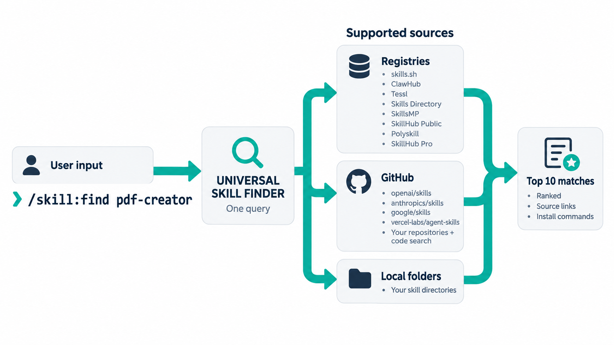

# Universal Skill Finder

### Find the skill your agent needs.

Search registries, GitHub repositories, and local folders with one query.
Get up to 10 ranked matches by default, with links, installation options, and source coverage.

[Sources](#supported-sources) · [Install](#install) · [Usage](#use-it) · [Configuration](#choose-your-sources)



Universal Skill Finder runs inside your coding agent. The default sources need no registry account or API key, and searching never installs or executes discovered skills.

## Supported sources

A **source** is a place Universal Skill Finder searches. Registries index skills, repositories contain their files, and a search index finds files across repositories.

<!-- source-defaults:start -->

| Source | Type | Default state | API key |
|---|---|:---:|---|
| [skills.sh](https://skills.sh) | Registry | Enabled | Not required |
| [SkillsMP](https://skillsmp.com) | Registry | Enabled | Optional |
| [ClawHub](https://clawhub.ai) | Registry | Enabled | Not required |
| [SkillHub Public](https://skills.palebluedot.live) | Registry | Enabled | Not required |
| [Tessl](https://tessl.io/registry) | Registry | Enabled | Not required |
| [Polyskill](https://polyskill.ai) | Registry | Disabled | Not required |
| [Skills Directory](https://www.skillsdirectory.com) | Registry | Disabled | Required |
| [SkillHub Pro](https://www.skillhub.club) | Registry | Disabled | Required |
| [GitHub code search](https://github.com/search?type=code) | Search index | Disabled | Required |
| [openai/skills](https://github.com/openai/skills) | Repository | Enabled | Not required |
| [anthropics/skills](https://github.com/anthropics/skills) | Repository | Enabled | Not required |
| [google/skills](https://github.com/google/skills) | Repository | Enabled | Not required |
| [vercel-labs/agent-skills](https://github.com/vercel-labs/agent-skills) | Repository | Enabled | Not required |

**13 bundled sources · 9 enabled by default.**

<!-- source-defaults:end -->

Add **your own GitHub repositories** and **local skill folders** through [source configuration](skills/find/references/configuration.md). None are configured by default.

These are shipped defaults. Ask **List sources** to see your settings. Each search reports which sources responded, used cached data, failed, or were skipped; enabled does not mean currently reachable.

## Install

Searching requires **Python 3.10+ with SSL** and a coding agent that supports skills and can run local commands. There are no third-party Python packages to install. The [Skills CLI](https://github.com/vercel-labs/skills#install-a-skill) installer also needs Node.js 22.20.0+, `npx`, and Git.

Choose the standalone skill or the native plugin to avoid duplicate entries.

**Claude Code**

```bash
claude plugin marketplace add bibryam/universal-skill-finder
claude plugin install skill@skill
```

**Codex**

```bash
codex plugin marketplace add https://github.com/bibryam/universal-skill-finder.git
codex plugin add skill@skill
```

**Install from GitHub**

```bash
npx skills add bibryam/universal-skill-finder --skill find --global
```

Choose your agents in the installer, then start a new session. Leave off `--global` for a project installation. Add `--agent codex`, `--agent claude-code`, another [supported agent](https://github.com/vercel-labs/skills#supported-agents), or `--agent '*'` for all. See [installation and updates](docs/installation.md) for local plugins, manual installation without Node.js, Windows instructions, and removal.

## Use it

Ask for the capability you need:

```text
Find skills for reading and filling PDF forms.
Find a React performance skill.
```

By default, Universal Skill Finder searches every enabled source and returns up to 10 ranked matches. You can also invoke it directly:

| Agent | Standalone skill | Native plugin |
|---|---|---|
| Claude Code | `/find pdf forms` | `/skill:find pdf forms` |
| Codex | `$find pdf forms` | `$skill:find pdf forms` |

In other agents, ask “Use Universal Skill Finder to find skills for PDF forms” or use the skill picker. Search works across compatible agents; generated installation commands and installed-skill checks currently support Codex and Claude Code. Other agents receive links to inspect.

### From a result to an installation

Reports stay in your terminal or agent conversation. They start with one short summary, then scan-first cards; detailed counts, warnings and source coverage follow below. Each card keeps up to 400 characters of description, combines repository and skill folder into one Location, and offers numbered inspection or installation actions instead of repeating a long command. Markdown keeps bold headings and labels. Direct CLI output adds color on supported interactive terminals; `NO_COLOR` disables it, and saved or redirected output has no ANSI codes. A browser report is available only if you explicitly ask for HTML.

Links appear only after the destination identity is checked. Installation commands require stronger exact-target evidence. “Found” counts unique candidates, not guaranteed install-ready skills.

An abbreviated example, not a live result:

```text
Search: pdf forms

24 matches · 10 shown
Sources: 5 searched · 4 cached

1. pdf
Read and fill PDF forms.
Location: anthropics/skills › skills/pdf
Found on: anthropic-skills (source page), skillsmp (listing not verified)
Signals: Not available
Inspect and install: type Inspect #1  Install #1
```

After selecting and reviewing #1, Universal Skill Finder can generate this Codex installation proposal:

```bash
npx skills@1.5.23 add https://github.com/anthropics/skills/tree/main/skills/pdf --skill pdf --agent codex --copy
```

Say **“Inspect #1”** to review a result or **“Install #1”** to request installation. Searching never runs the installer, and installation requires your approval. GitHub skill installations use the separate [Skills CLI](https://github.com/vercel-labs/skills/tree/v1.5.23), with the requirements listed above.

Say **“Next page”** or **“Show more”** to continue the saved search without rerunning sources. Numbering stays stable; Show more can raise the overall cap to 100 using the original candidate pool. For direct CLI use, `--count N` controls the overall cap, `--page-size N` controls page size, and `--report-json` saves the snapshot needed for continuation.

<details>
<summary>How to read signals and installed-skill labels</summary>

Signals are source-labelled snapshots. Missing values appear as **Not available**. GitHub stars describe the whole repository; search uses only already cached repository metadata and never waits for a foreground star lookup. Popularity and Tessl assessments do not certify quality or safety.

If Universal Skill Finder cannot generate an install command, it links to the exact skill directory, repository, or listing and explains why.

Universal Skill Finder checks standard local skill directories to label installed matches and name collisions without uploading their contents. This does not add those folders as search sources. Ask it to **skip the installed-skill check** to opt out.

</details>

## Choose your sources

Use the same controls for every source type:

```text
List sources.
Disable skillsmp.
Enable tessl.
```

Changes persist across sessions and upgrades. Disabling a source stops Universal Skill Finder from querying it during searches and preserves the other sources' settings.

<details>
<summary>Edit the source configuration directly</summary>

Ask **Create source config** to generate the complete list with your current choices. The normal location is `~/.config/universal-skill-finder/sources.json`; **Show source config** gives you the exact path. Edit each `enabled` flag:

```json
{
  "sources": [
    {"id": "skills-sh", "enabled": true},
    {"id": "skillsmp", "enabled": false},
    {"id": "tessl", "enabled": true}
  ]
}
```

This example disables SkillsMP; it is not the default configuration. Omitted IDs inherit their defaults, so set `enabled: false` rather than deleting a row. The generated file includes every configured source. Listing and searching never create or rewrite it.

Existing configuration paths and choices are preserved. Advanced source packs can also disable their members; **List sources** explains any pack blocker. Normal setup needs only the source list and its boolean flags.

</details>

<details>
<summary>API keys and optional sources</summary>

| Source ID | Environment variable | Requirement |
|---|---|---|
| `skillsmp` | `SKILLSMP_API_KEY` | Optional |
| `skills-directory` | `SKILLS_DIRECTORY_API_KEY` | Required |
| `skillhub-pro` | `SKILLHUB_API_KEY` | Required |
| `github-code-search` | `UNIVERSAL_SKILL_FINDER_GITHUB_TOKEN` | Required |

Supplying a key does not enable a source. GitHub code search needs a dedicated token without private-repository access; see [source configuration](skills/find/references/configuration.md#optional-github-code-search).

</details>

See [configuration](skills/find/references/configuration.md) for custom sources, source packs, and advanced options.

## Privacy and security

- Search queries go only to enabled remote search services. Configured GitHub repositories are downloaded and filtered locally.
- Project files are not uploaded. Local discovery reads `SKILL.md` files on your machine.
- Universal Skill Finder has no analytics or telemetry. Queries and discovered metadata are cached locally.
- Searching does not execute discovered instructions, scripts, hooks, or packages. Installation is a separate action.

Universal Skill Finder discovers skills; it does not scan them for security. Publisher labels, popularity, and third-party assessments are evidence to review, not guarantees. See [SECURITY.md](SECURITY.md) for the threat model, limitations, and reporting guidance.

## Troubleshooting

<details>
<summary>Installation, Python, failed sources, and offline searches</summary>

| Symptom | What to do |
|---|---|
| Skill or plugin not visible | Start a new task/session and check the installation scope and selected agent. In Claude Code, try `/reload-plugins` for plugins. |
| Python prerequisite warning | Make Python 3.10+ with SSL available, then retry. |
| `codex plugin` unavailable | Update Codex, or install the standalone skill folder. |
| A source failed | Read the reported reason. Other sources still return results. Ask Universal Skill Finder to retry with fresh data. |
| `cache access denied` or public hosts cannot resolve in a sandbox | Approve the host's normal access request for the same search if appropriate. Do not erase health state or change cache directories to bypass the restriction. |
| Candidates found but zero verified results | Read the verification notes and source coverage. Incomplete checks do not mean there are no matching skills. |
| Output still uses an older layout | Start a new session and check which skill/plugin copy the host loaded. Editing a checkout does not update a separately installed copy. |
| Missing API key | Set the named key or disable that optional source. Do not paste keys into source packs. |
| No cached data offline | Retry online, or use a query that was previously cached. |
| No matches | Try a concrete capability such as “pdf forms” and check which sources completed. |

Ask Universal Skill Finder to check its setup for local configuration and credential presence. A real search reports current endpoint coverage.

</details>

## Contribute

Found a missing source or an unhelpful result? Open an issue with the query, source status, and sanitized output. Start with [CONTRIBUTING.md](CONTRIBUTING.md), [Architecture](ARCHITECTURE.md), or the [result schema](skills/find/references/result-schema.md). New connectors need fixture tests and a documented API boundary.

⭐ If Universal Skill Finder saves you time, [star the repository](https://github.com/bibryam/universal-skill-finder).

## Version history

See [CHANGELOG.md](CHANGELOG.md) for release notes.

## License

[MIT](LICENSE). The portable skill includes its own copy of the license.
