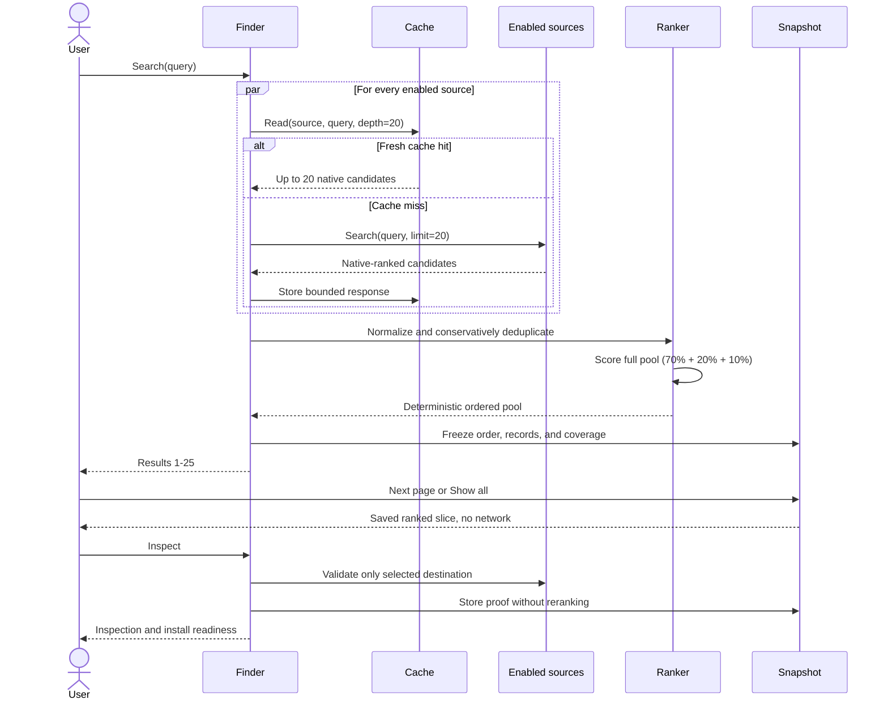

# Architecture

## Position

The system should federate discovery, not centralize ownership. It searches configured sources through registry APIs, GitHub archives, local directories, and GitHub code search, then returns a traceable merged view. It does not mirror registries, execute third-party adapters, or combine unrelated popularity numbers into a false universal score.

**Source** covers four types: **Registry** for a hosted skill index, **Repository** for Git files containing skills, **Local directory** for files on disk, and **Search index** for GitHub code search. A **catalogue** is a combined list or index; a **connector** is the code that searches a source. The `source_*` contract fields and source-pack definitions retain these names.

## Integration approach

The engine talks to each configured source through a reviewed connector instead
of delegating discovery to third-party finder tools. Source definitions are
declarative, connector code is allowlisted, and installation handoffs are
structured separately from search. The presentation layer can build a
display-only command for a verified target, but the search engine never runs
that command or parses another tool's console output.

```text
bundled defaults + sources.json
             |
             v
 packs -> source instances -> reviewed adapters
                              |       |
                         registries  repository archives/local trees
                              \       /
                         normalized candidates
                                  |
                   conservative identity merge
                                  |
                    70/20/10 ranking + frozen pool
                                  |
             compact pages ---- explicit Inspect #N
                                      |
                         live proof + install proposal
```

## Three extension units

| Unit | Owns | Typical change | Review level |
|---|---|---|---|
| Connector / adapter | Transport, authentication pattern, pagination, and response mapping | Support a new protocol or incompatible API | Code change and tests |
| Source | One endpoint, repository, or local tree plus adapter options | Add `owner/repository` or a compatible endpoint | Configuration only |
| Pack | A named group of sources | Import, enable, disable, or remove a curated collection | Review JSON destinations and mappings |

Adapters are code-owned. Source configuration cannot name a Python module, shell command, executable, or downloaded plugin. This is deliberate. An arbitrary executable adapter would turn a search query into remote code execution authority.

`adapters/__init__.py` contains one immutable `ADAPTER_SPECS` catalogue. Each typed descriptor declares its factory, source kind, required fields, cache policy, relevance basis, and contract version. Configuration validation, source-pack kind inference, runtime construction, federation cache routing, and result admission use it. Add one registration for a new protocol; do not maintain parallel allowlists.

The `Adapter.search(source, query, limit, context) -> list[Candidate]` contract returns at most the requested limit in native order or raises `SourceUnavailable` for a recognized failure. Instances are shared across concurrent source calls and must be stateless. The context supplies guarded transport, cache, settings, and offline/refresh flags. Query caching belongs to federation, catalogue caching to repository connectors, and local reads are uncached. Federation validates candidates and rebinds source authority.

## Adapter families

The implementation has four useful families:

1. Named registry adapters handle known API contracts and their specific authentication or response details.
2. `github-repo` and `local-directory` find `SKILL.md` files using include/exclude patterns, then search their parsed name, description, and path.
3. `http-json-v1` supports constrained HTTPS GET APIs with dotted-field mappings and environment-backed credential headers.
4. `github-code-search` searches public indexed `SKILL.md` files through a fixed authenticated GitHub API boundary, then validates bounded blob contents without downloading whole repositories.

Use an existing family when its contract fits exactly. Add a reviewed adapter when a source needs OAuth, request signing, POST semantics, custom pagination, HTML parsing, non-JSON data, or a response that cannot be expressed safely by `http-json-v1`.

`tessl` is a named registry adapter for the public JSON:API hybrid-search contract, not a wrapper around the Tessl CLI or MCP server. It requests public skill-bearing index entries in one bounded anonymous GET, maps individual GitHub skills and inspection-only skill bundles separately, and preserves incomplete coverage. For an individual GitHub skill, the adapter retains the GitHub repository/path as canonical identity and constructs Tessl's code-owned `/registry/skills/github/OWNER/REPOSITORY/SKILL` discovery route from strict repository and skill-name fields. That structural review can activate a search link without asserting liveness. Inspect performs the later exact page and identity check. The connector does not follow remote pagination links or infer Git revisions from score versions. Scores remain source-labelled assessments; missing source identity and unsupported providers cannot silently merge unrelated skills.

## Upstream finder integration

An upstream finder such as `skill-fetch` can be valuable as a maintained inventory of repositories and registries. The stable integration boundary is its source definitions, not its runtime:

1. Extract candidate source definitions.
2. Verify ownership, endpoint, protocol, and current response shape.
3. Map each candidate to an existing adapter or write and test a new adapter.
4. Publish the reviewed definitions as a source pack or bundled defaults.
5. Track provenance in the source definition.

The finder does not invoke upstream search code, scrape its console output, or inherit its install behavior. Executing another finder would make coverage opaque, duplicate caching and ranking policy, widen the supply-chain boundary, and make per-source enable/disable controls unreliable.

There is intentionally no automatic remote pack import. `packs import` reads a local JSON file so the user can inspect destinations and credential references before changing the overlay.

## Source choices

Ordinary enable/disable choices use one configuration file, defaulting to `~/.config/universal-skill-finder/sources.json` for a new installation and honoring `$XDG_CONFIG_HOME`. It contains a `sources` list of known `id` / boolean `enabled` pairs; omitted IDs retain catalogue defaults. It does not expose endpoint or credential editing. Duplicate/unknown IDs, extra entry fields, and invalid boolean values fail validation.

`sources config-path` is read-only. `sources init` explicitly materializes all known entries with existing choices. `sources enable|disable ID` writes the same list. Searches and lists never initialize or rewrite it. The older `repositories` command and `--repository` flag remain aliases for `sources` and `--source`; result schema-1 fields retain their existing names.

User choices live in `universal-skill-finder/sources.json` unless an explicit path or `UNIVERSAL_SKILL_FINDER_CONFIG` is supplied. A file must contain only one choice format. Explicit saves normalize choices to `sources` while retaining advanced `custom_sources`, `custom_packs`, and `pack_overrides`. A disabled pack still requires explicit pack enablement. Public search reports are schema 2; source candidate and cache shapes remain version 1, while the adapter contract is version 2. See [configuration](configuration.md#files-and-precedence) for exact precedence.

## Federation pipeline

Before this pipeline, the plugin's POSIX or PowerShell launcher checks Python 3.10+ and working SSL. Missing, old, or broken runtimes stop with exit 4 before engine imports, configuration/cache access, or network requests. The plugin manager itself may install files without this check. No global hooks or automatic dependency installation are used.



1. Merge immutable bundled defaults with the user overlay.
2. Resolve direct and pack-level enablement.
3. Select or exclude sources requested on the command line.
4. In `--dry-run`, report planned hosts without sending the query.
5. Otherwise, admit runnable sources fairly by source class and execute them concurrently under the shared process supervisor, deadline, request/byte budget, per-origin permit, and API quota contracts. Request up to 20 native results from every source by default. Supported process-isolation paths can terminate and reap blocked children; deterministic injected test adapters remain in-process.
6. Isolate every source failure. Freeze the accepted pool at collection cutoff; late or preempted work remains explicit coverage rather than evidence that the source is down.
7. Normalize source results into `Candidate` records and apply the adapter's code-owned retrieval contract. Provider-query connectors retain the provider's bounded response even when local metadata has no lexical overlap. Repository and local catalogues search their full bounded catalogue locally and still require a compatible lexical match. They are never padded to the requested depth.
8. Merge only strong identities and narrowly reconcile pathless repository matches. Preserve every occurrence and source-native metric separately.
9. Rank the complete unique pool with `discovery-70-20-10-v1`, retain component evidence and deterministic tie-breaks, then freeze the order. Destination state is not an input.
10. Publish the first 25 ranked results by default. A connector-reviewed registry route or normalized GitHub identity may be shown as a discovery link without a network validation claim. Save up to 100 numbered results for ordinary paging.
11. For a known assistant, annotate the complete frozen result pool from one bounded local installed-skill inventory unless explicitly skipped. These observations never enter ranking, source candidates, or query caches.
12. `Next page` and `Show all` slice only the frozen pool. `Inspect #N` separately validates that result's current destinations and exact target, then stores the evidence without changing rank or numbering.

Registry query responses use a short cache keyed by source, exact query, and requested depth, so the default cache entry contains at most 20 source-ranked candidates. `cache list` exposes available query metadata for offline use. Repository catalogues use a longer cache because indexing a repository archive costs more than filtering an existing catalogue; a cached catalogue can answer new queries locally. `--offline` uses cached registry queries, cached repository catalogues, and local directories only. A cache miss is reported, not bypassed with a network request.

Cross-process cache leases return boolean-compatible typed outcomes: acquired, busy, permission denied or storage unavailable. Failed acquisition never grants ownership or bypasses source cooldowns. Local access/storage errors are distinct from lock contention, including in cached fallback coverage and proof diagnostics. Known DNS and cache-access failures are summarized in report notes without copying arbitrary exception text. A sandboxed host must request access through its normal permission mechanism for the configured cache and public network; the engine does not silently relocate state or relax verification.

## Identity and deduplication

Names are not identities. Two publishers can legitimately ship skills with the same name.

Strong aliases are derived from the best evidence available:

- normalized GitHub repository plus skill path;
- repository plus slug when no path is known;
- hosted registry namespace plus publisher plus slug;
- normalized canonical URL;
- source ID plus native ID as a final fallback.

A pathless repository occurrence may join a path-bearing result only when its repository-and-slug points to one unambiguous path group. It is not used to merge two different paths. Every original occurrence remains in the output for auditability.

Canonical URL identities retain query, fragment, and semicolon parameters because they can distinguish different skills or SPA routes. Query order is preserved; conservative separation is preferable to merging unrelated install targets.

## Ranking

`discovery-70-20-10-v1` computes one bounded score from three components:

- **70% query relevance.** Name coverage contributes 50% of this component, description coverage 30%, path/tags 10%, and an exact or ordered phrase 10%. All lexical evidence comes from one coherent occurrence rather than stitching the best fields from different sources.
- **20% source-local signal.** Native rank contributes 70% of this component after normalization against the requested source depth. One typed skill-level metric contributes 30% after percentile normalization only among comparable observations from that same source. Missing native ranks or comparable metrics are neutral.
- **10% independent-source corroboration.** One connector family contributes 0, two contribute 0.5, and three or more contribute 1. Mirrored source instances using the same adapter count once.

Separator-only compounds such as `anti-slop` and `antislop` are equivalent. Provider-query connectors can contribute low-scoring candidates without local lexical overlap because the remote provider already evaluated the query; local repository and directory searches still require a positive match. Final ties use relevance, phrase match, source signal, corroboration, normalized name, and stable identity in that order.

Raw counts are never compared across sources or added together. Destination validity, installation readiness, source completion order, trust labels, repository-level metrics, security grades, and reciprocal rank fusion do not affect the selected order. RRF remains a compatibility diagnostic. Lexical evidence is not semantic confidence, and destination proof establishes reachability and identity rather than capability quality or safety.

## Coverage is part of the answer

Every configured source gets one coverage record. Common states include `ok`, `cached`, `disabled`, `not_selected`, `excluded`, `planned`, `offline_miss`, `auth_missing`, `auth_failed`, `rate_limited`, `timeout`, `schema_mismatch`, `archive_limit`, and `failed`.

`AdapterContext.incomplete_results` and `detail` let a connector disclose incomplete upstream searches, skipped source checks, or exhausted bounds without discarding accepted candidates. Federation persists those fields through query caching, including zero-result responses; `Coverage.incomplete_results` is independent of `ok`/`cached`. The presenter labels partial coverage explicitly, and strict mode fails. Legacy compatible cache payloads without these optional fields default to complete.

GitHub code search has one fixed API origin and explicitly named search credential, public-only retained candidates, bounded file/byte/request/time budgets, verified Git blob hashes and required name/description frontmatter. The legacy API has no documented public-only query filter, so setup calls for a token without private-repository access; broader tokens may return private metadata that is discarded. Public blob requests omit credentials to enforce public accessibility, at the cost of lower anonymous quotas. Raw content proof, the browsable GitHub skill directory, and the repository root remain separate destinations with separate roles. Missing commit evidence never becomes a guessed branch. Optional repository metrics are cached-only and never delay this connector. It is opt-in, not a replacement for known-repository catalogue scanning.

Therefore “no results” means only “no candidates in the sources that completed.” It never proves ecosystem-wide absence. Coverage labels distinguish the bounded candidates each source contributed from results visible on the globally ranked page. A source's pool count is not its total match count, and page counts overlap when several sources reported the same skill.

Destination verification is on demand. Inspect keeps the existing fixed deadline, request budget, concurrency limit, and exact-target proof rules, but applies them to one selected result. Failure or timeout changes only that result's inspection evidence. It never removes, renumbers, or reranks discovery results.

The plugin uses `search --markdown --assistant codex` or `--assistant claude-code` internally through the launcher. `presentation.py` renders deterministic two-line numbered discovery entries directly in the terminal/conversation: linked name and path, then reporting sources, one metric, and up to 180 characters of description. The compact page omits source tables and destination partitions; `details` and `inspect` expose those only when requested. Raw content and GitHub blob-file URLs are never human navigation. JSON remains the separate structured-data contract.

Only an explicit HTML-report request should use `search --html` or `page --html`. This optional export has native disclosure controls and the same proof gates for report-derived links, without JavaScript or external assets. Its fixed project footer is the same application-owned exception as in Markdown. It is not the default skill presentation; browser availability is not a reason to select it. Compact-output requests use Markdown/plain output and do not launch a browser.

Reports lead with the query and one summary line containing unique pool size, completed sources, visible range, and ordering basis. Markdown keeps only the minimal bold labels. `terminal.py` adds fixed ANSI color/bold only after plain report rendering, at the interactive CLI stdout boundary. The renderer stays deterministic and ANSI-free; saved artifacts, pipes, Markdown and JSON are never styled. `NO_COLOR` and unsupported/dumb terminals disable styling. Styling never activates additional links or implies a safety verdict.

Completed online reports end with the single-line canonical project link `[https://github.com/bibryam/universal-skill-finder](https://github.com/bibryam/universal-skill-finder)`, without ASCII art or a verification caveat. The application owns this fixed URL, so the footer needs no report proof or network work. It is absent from previews, offline output, help, source management and all-source failures.

`source_presentation.py` provides a read-only linked source table for `sources list --markdown`, with `Source | Type | Requirements | Ask to change | Enabled` columns and an allowlisted JSON view. Public links are derived from configuration, never guessed from an ambiguous target string or copied from credential-bearing API URLs. Explicit source toggles persist in the overlay; disabled packs remain a separate authority boundary.

`sources explain` uses the same allowlisted metadata, never raw API routes, headers, or local-directory paths. `doctor` checks required named-adapter and generic-header credential references without printing values. Setup diagnostics are not live authentication checks.

Inspection fallbacks contain a checked repository or listing link and reason. Compact discovery results show one available count metric; inspection preserves the full source-separated observations. Repository stars are used only from a fresh, separately scoped cache entry whose repository identity, value, and observation time validate. Search never fetches or waits for them, and repository-scoped metrics never affect ranking.

Display-only installation commands use the pinned Skills CLI interface with an exact GitHub directory, explicit branch/tag, exact skill name, `--agent`, and `--copy`. No executable hints from registries or caches are accepted. Source inspection and explicit approval precede any separate execution by the coding assistant. The external CLI has additional runtime requirements and can skip its own prompts inside agents; see the [installation handoff](result-schema.md#installation-handoff).

## Security boundaries

- Disabled, excluded, unselected, and offline cache-miss sources receive no query.
- Network definitions require HTTPS, except an explicitly allowed local development endpoint.
- The generic adapter is GET-only and declarative.
- Secret values come from named environment variables, never pack files.
- Repository archives have compressed size, member count, actual gzip expansion (including extended tar headers), declared uncompressed size, skill count, and per-file limits.
- Archive entries are read in memory. Hooks, scripts, packages, and discovered skill instructions are never executed.
- Registry descriptions, repository contents, metrics, URLs, and structured installation hints are untrusted data. Markdown text and links are escaped; display-only commands are constructed locally from a narrow argument whitelist, never copied from source metadata.
- Installation is a separate, explicit-approval action.
- Anonymous production validation bounds DNS and the complete HTTPS exchange, including trickling headers/body, with killable child processes. Executor joins are deadline-bounded too; arbitrary injected in-process transports must honor their timeout and remain responsible for their own I/O. They cannot publish result or proof-cache state after the deadline.
- Cache writes check their publication guard immediately before atomic replacement, as well as before serialization. A source or proof that completes late cannot publish a late cache entry.

## Deliberate limits

- No exhaustive GitHub crawl. Optional GitHub code search is bounded and limited by GitHub's public-file index; the repository adapter still scans only configured repositories.
- No complete installed-plugin inventory or automatic replacement. Local annotation checks only standard current-project/user roots and distinguishes instruction matches from name collisions.
- No live remote adapter or pack loading.
- No HTML scraping fallback.
- No universal trust or popularity score.
- No automatic installation or update.

These limits keep discovery predictable. Add breadth through reviewed source packs; add protocol capability through reviewed adapters.

## Version and revision contract

`versioning.py` is authoritative for the release version, public JSON schema, adapter contract, and cache format. Search reports include code, catalogue, and effective-configuration SHA-256 revisions. `doctor` prints the same versions and revisions. Code identity covers engine files and the packaged instructions, launchers, references, and example packs; catalogue identity uses canonical JSON. Effective configuration hashes source order/settings/state and credential-variable names, never environment credential values or the overlay location.

Copied skill payloads retain identical revisions. A wheel without adjacent skill instructions reports the narrower `engine` scope. These are content identifiers, not Git commits, signatures, or security attestations. Compatible caches can survive code changes; incompatible cache/adapter versions and legacy envelopes are treated as misses without deletion or online fallback.

Configuration writes use an exclusive adjacent lock and compare the originally loaded bytes before atomic replacement. Stale writers fail and must reload, preserving the other session's changes. An interrupted writer may leave a lock requiring inspection. External editors that ignore the lock can still race a write.
